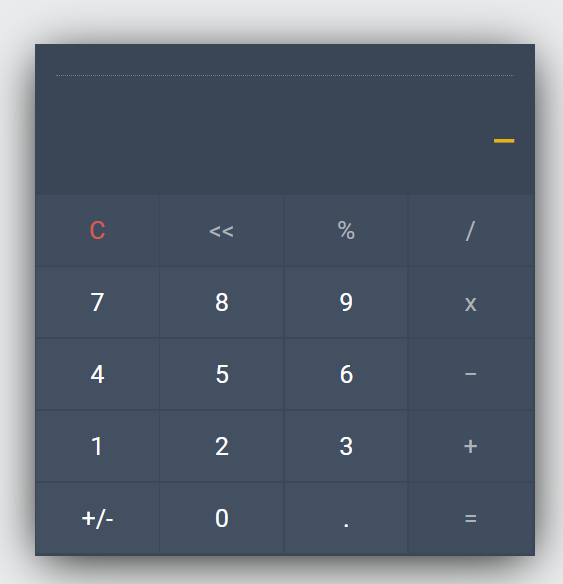

<div align="center">
  <h1 align="center">Calculadora</h1>
</div>

<p align="center">
Aplicacação desenvolvida para o curso da GamaAcademy para revisar fundamentos de Javascript.</p> 
<br />
<div align="center">
  
</div>

---

## 📱 Tela

<div align="center">
  
</div>
<br />

---

## 🏁 Iniciando o projeto

```bash
  # Clone o repositório
  $ git clone git@github.com:plmsz/simple_calc_js.git

  # Abra o arquivo index.html
```

 <br />

---

## 📫 Você pode me contatar em:

<div align="center">

</div>
<div align="center">
</br>

[](https://www.linkedin.com/in/plmsz/)
[](mailto:plmsouzaoliveira@gmail.com)
[](https://twitter.com/plmszdev)
</span>
